# Ruby DSL for Claude Code hooks

> [!IMPORTANT]
> v1.0.0 just released and is introducing breaking changes. Please read the [CHANGELOG](CHANGELOG.md) for more information.


A Ruby DSL (Domain Specific Language) for creating Claude Code hooks. This will hopefully make creating and configuring new hooks way easier.

[**Why use this instead of writing bash, or simple ruby scripts?**](docs/WHY.md)

> You might also be interested in my other project, a [Claude Code statusline](https://github.com/gabriel-dehan/claude_monitor_statusline) that shows your Claude usage in realtime, inside Claude Code ✨.


## 📖 Table of Contents

- [Ruby DSL for Claude Code hooks](#ruby-dsl-for-claude-code-hooks)
    - [📖 Table of Contents](#-table-of-contents)
    - [🚀 Quick Start](#-quick-start)
    - [📦 Installation](#-installation)
    - [🏗️ Architecture](#-architecture)
    - [🪝 Hook Types](#-hook-types)
    - [🚀 Claude Hook Flow](#-claude-hook-flow)
    - [📚 API Reference](#-api-reference)
    - [📝 Example: Tool usage monitor](#-example-tool-usage-monitor)
    - [🔄 Hook Output](#-hook-output)
    - [🔌 Plugin Hooks Support](#-plugin-hooks-support)
    - [🚨 Advices](#-advices)
    - [⚠️ Troubleshooting](#-troubleshooting)
    - [🧪 CLI Debugging](#-cli-debugging)
    - [🐛 Debugging](#-debugging)
    - [🧪 Development \& Contributing](#-development--contributing)

## 🚀 Quick Start

> [!TIP]
> Examples are available in [`example_dotclaude/hooks/`](example_dotclaude/hooks/). The GithubGuard in particular is a good example of a solid hook. You can also check [Kyle's hooks for some great examples](https://github.com/kylesnowschwartz/dotfiles/blob/main/claude/hooks)

Here's how to create a simple hook:

1. **Install the gem:**
```bash
  gem install claude_hooks
```

1. **Create a simple hook script**
```ruby
#!/usr/bin/env ruby
require 'json'
require 'claude_hooks'

# Inherit from the right hook type class to get access to helper methods
class AddContextAfterPrompt < ClaudeHooks::UserPromptSubmit
  def call
    log "User asked: #{prompt}"
    add_context!("Remember to be extra helpful!")
    output
  end
end

# Run the hook
if __FILE__ == $0
  # Read Claude Code's input data from STDIN
  input_data = JSON.parse(STDIN.read)

  hook = AddContextAfterPrompt.new(input_data)
  hook.call

  # Handles output and exit code depending on the hook state.
  # In this case, uses exit code 0 (success) and prints output to STDOUT
  hook.output_and_exit
end
```

3. ⚠️ **Make it executable**
```bash
chmod +x add_context_after_prompt.rb
# Test it
echo '{"session_id":"test","prompt":"Hello!"}' | ./add_context_after_prompt.rb
```

4. **Register it in your `.claude/settings.json`**
```json
{
  "hooks": {
    "UserPromptSubmit": [{
      "matcher": "",
      "hooks": [
        {
          "type": "command",
          "command": "path/to/your/hook.rb"
        }
      ]
    }]
  }
}
```
That's it! Your hook will now add context to every user prompt. 🎉

> [!TIP]
> This was a very simple example but we recommend using the entrypoints/handlers architecture [described below](#recommended-structure-for-your-claudehooks-directory) to create more complex hook systems.

## 📦 Installation

### Install it globally (simpler):

```bash
$ gem install claude_hooks
```

### Using a Gemfile

> [!WARNING]
> Unless you use `bundle exec` in the command in your `.claude/settings.json`, Claude Code will use the system-installed gem, not the bundled version.

Add it to your Gemfile (you can add a Gemfile in your `.claude` directory if needed):

```ruby
# .claude/Gemfile
source 'https://rubygems.org'

gem 'claude_hooks'
```

And then run:

```bash
$ bundle install
```

### 🔧 Configuration

Claude Hooks supports both home-level (`$HOME/.claude`) and project-level (`$CLAUDE_PROJECT_DIR/.claude`) directories. Claude Hooks specific config files (`config/config.json`) found in either directory will be merged together.

| Directory                     | Description              | Purpose                       |
|-------------------------------|--------------------------|-------------------------------|
| `$HOME/.claude`               | Home Claude directory    | Global user settings and logs |
| `$CLAUDE_PROJECT_DIR/.claude` | Project Claude directory | Project-specific settings     |

> [!NOTE]
> Logs always go to `$HOME/.claude/{logDirectory}`

#### Environment Variables

You can configure Claude Hooks through environment variables with the `RUBY_CLAUDE_HOOKS_` prefix:

```bash
# Existing configuration options
export RUBY_CLAUDE_HOOKS_LOG_DIR="logs"                  # Default: logs (relative to $HOME/.claude)
export RUBY_CLAUDE_HOOKS_CONFIG_MERGE_STRATEGY="project" # Config merge strategy: "project" or "home", default: "project"
export RUBY_CLAUDE_HOOKS_BASE_DIR="~/.claude"            # DEPRECATED: fallback base directory

# Any variable prefixed with RUBY_CLAUDE_HOOKS_
# will also be available through the config object
export RUBY_CLAUDE_HOOKS_API_KEY="your-api-key"
export RUBY_CLAUDE_HOOKS_DEBUG_MODE="true"
export RUBY_CLAUDE_HOOKS_USER_NAME="Gabriel"
```

#### Configuration Files

You can also use configuration files in any of the two locations:

**Home config** (`$HOME/.claude/config/config.json`):
```json
{
  // Existing configuration option
  "logDirectory": "logs",
  // Custom configuration options
  "apiKey": "your-global-api-key",
  "userName": "Gabriel"
}
```

**Project config** (`$CLAUDE_PROJECT_DIR/.claude/config/config.json`):
```json
{
  // Custom configuration option
  "projectSpecificConfig": "someValue",
}
```

#### Configuration Merging

When both config files exist, they will be merged with configurable precedence:

- **Default (`project`)**: Project config values override home config values
- **Home precedence (`home`)**: Home config values override project config values

Set merge strategy: `export RUBY_CLAUDE_HOOKS_CONFIG_MERGE_STRATEGY="home" | "project"` (default: "project")

> [!WARNING]
> Environment Variables > Merged Config Files

#### Accessing Configuration Variables

You can access any configuration value in your handlers:

```ruby
class MyHandler < ClaudeHooks::UserPromptSubmit
  def call
    # Access directory paths
    log "Home Claude dir: #{home_claude_dir}"
    log "Project Claude dir: #{project_claude_dir}" # nil if CLAUDE_PROJECT_DIR not set
    log "Base dir (deprecated): #{base_dir}"
    log "Logs dir: #{config.logs_directory}"

    # Path utilities
    log "Home config path: #{home_path_for('config')}"
    log "Project hooks path: #{project_path_for('hooks')}" # nil if no project dir

    # Access custom config via method calls
    log "API Key: #{config.api_key}"
    log "Debug mode: #{config.debug_mode}"
    log "User: #{config.user_name}"

    # Or use get_config_value for more control
    user_name = config.get_config_value('USER_NAME', 'userName')
    log "Username: #{user_name}"

    output
  end
end
```

## 🏗️ Architecture

### Core Components

1. **`ClaudeHooks::Base`** - Base class with common functionality (logging, config, validation)
2. **Hook Handler Classes** - Self-contained classes (`ClaudeHooks::UserPromptSubmit`, `ClaudeHooks::PreToolUse`, etc.)
3. **Output Classes** - `ClaudeHooks::Output::UserPromptSubmit`, etc... are output objects that handle intelligent merging of multiple outputs, as well as using the right exit codes and outputting to the proper stream (`STDIN` or `STDERR`) depending on the the hook state.
4. **Configuration** - Shared configuration management via `ClaudeHooks::Configuration`
5. **Logger** - Dedicated logging class with multiline block support

### Recommended structure for your .claude/hooks/ directory

```
.claude/hooks/
├── entrypoints/                # Main entry points
│   ├── notification.rb
│   ├── pre_tool_use.rb
│   ├── post_tool_use.rb
│   ├── pre_compact.rb
│   ├── session_start.rb
│   ├── stop.rb
│   └── subagent_stop.rb
|
└── handlers/                    # Hook handlers for specific hook type
    ├── user_prompt_submit/
    │   ├── append_rules.rb
    │   └── log_user_prompt.rb
    ├── pre_tool_use/
    │   ├── github_guard.rb
    │   └── tool_monitor.rb
    └── ...
```

## 🪝 Hook Types

The framework supports the following hook types:

| Hook Type                                              | Class                           | Description                                                                |
|--------------------------------------------------------|---------------------------------|----------------------------------------------------------------------------|
| **[SessionStart](docs/API/SESSION_START.md)**          | `ClaudeHooks::SessionStart`     | Hooks that run when Claude Code starts a new session, resumes, or compacts |
| **[UserPromptSubmit](docs/API/USER_PROMPT_SUBMIT.md)** | `ClaudeHooks::UserPromptSubmit` | Hooks that run before the user's prompt is processed                       |
| **[Notification](docs/API/NOTIFICATION.md)**           | `ClaudeHooks::Notification`     | Hooks that run when Claude Code sends notifications                        |
| **[PreToolUse](docs/API/PRE_TOOL_USE.md)**             | `ClaudeHooks::PreToolUse`       | Hooks that run before a tool is used                                       |
| **[PostToolUse](docs/API/POST_TOOL_USE.md)**           | `ClaudeHooks::PostToolUse`      | Hooks that run after a tool is used                                        |
| **[Stop](docs/API/STOP.md)**                           | `ClaudeHooks::Stop`             | Hooks that run when Claude Code finishes responding                        |
| **[SubagentStop](docs/API/SUBAGENT_STOP.md)**          | `ClaudeHooks::SubagentStop`     | Hooks that run when subagent tasks complete                                |
| **[SessionEnd](docs/API/SESSION_END.md)**              | `ClaudeHooks::SessionEnd`       | Hooks that run when Claude Code sessions end                               |
| **[PreCompact](docs/API/PRE_COMPACT.md)**              | `ClaudeHooks::PreCompact`       | Hooks that run before transcript compaction                                |

## 🚀 Claude Hook Flow

### A very simplified view of how a hook works in Claude Code

Claude Code hooks in essence work in a very simple way:
- Claude Code passes data to the hook script through `STDIN`
- The hook uses the data to do its thing
- The hook outputs data to `STDOUT` or `STDERR` and then `exit`s with the proper code:
    - `exit 0` for success
    - `exit 1` for a non-blocking error
    - `exit 2` for a blocking error (prevent Claude from continuing)


The main issue is that there are many different types of hooks and they each have different expectations regarding the data outputted to `STDIN` or `STDERR` and Claude Code will react differently for each specific exit code used depending on the hook type.

### 🔄 Proposal: a more robust Claude Hook execution flow

1. An entrypoint for a hook is set in `~/.claude/settings.json`
2. Claude Code calls the entrypoint script (e.g., `hooks/entrypoints/pre_tool_use.rb`)
3. The entrypoint script reads STDIN and coordinates multiple **hook handlers**
4. Each **hook handler** executes and returns its output data
5. The entrypoint script combines/processes outputs from multiple **hook handlers**
6. And then returns final response to Claude Code with the correct exit code

```mermaid
graph TD
  A[🔧 Hook Configuration<br/>settings.json] --> B
  B[🤖 Claude Code<br/><em>User submits prompt</em>] --> C[📋 Entrypoint<br />entrypoints/user_prompt_submit.rb]

  C --> D[📋 Entrypoint<br />Parses JSON from STDIN]
  D --> E[📋 Entrypoint<br />Calls hook handlers]

  E --> F[📝 Handler<br />AppendContextRules.call<br/><em>Returns output</em>]
  E --> G[📝 Handler<br />PromptGuard.call<br/><em>Returns output</em>]

  F --> J[📋 Entrypoint<br />Calls _ClaudeHooks::Output::UserPromptSubmit.merge_ to 🔀 merge outputs]
  G --> J

  J --> K[📋 Entrypoint<br />- Writes output to STDOUT or STDERR<br />- Uses correct exit code]
  K --> L[🤖 Yields back to Claude Code]
  L --> B
```



### Basic Hook Handler Structure

```ruby
#!/usr/bin/env ruby

require 'claude_hooks'

class AddContextAfterPrompt < ClaudeHooks::UserPromptSubmit
  def call
    # Access input data
    log do
      "--- INPUT DATA ---"
      "session_id: #{session_id}"
      "cwd: #{cwd}"
      "hook_event_name: #{hook_event_name}"
      "prompt: #{current_prompt}"
      "---"
    end

    log "Full conversation transcript: #{read_transcript}"

    # Use a Hook state method to modify what's sent back to Claude Code
    add_additional_context!("Some custom context")

    # Control execution, for instance: block the prompt
    if current_prompt.include?("bad word")
      block_prompt!("Hmm no no no!")
      log "Prompt blocked: #{current_prompt} because of bad word"
    end

    # Return output if you need it
    output
  end
end

# Use your handler (usually from an entrypoint file, but this is an example)
if __FILE__ == $0
  # Read Claude Code's input data from STDIN
  input_data = JSON.parse(STDIN.read)

  hook = AddContextAfterPrompt.new(input_data)
  # Call the hook
  hook.call

  # Uses exit code 0 (success) and outputs to STDIN if the prompt wasn't blocked
  # Uses exit code 2 (blocking error) and outputs to STDERR if the prompt was blocked
  hook.output_and_exit
end
```

## 📚 API Reference

The goal of those APIs is to simplify reading from `STDIN` and writing to `STDOUT` or `STDERR` as well as exiting with the right exit codes: the way Claude Code expects you to.

Each hook provides the following capabilities:

| Category                | Description                                                                                                                    |
|-------------------------|--------------------------------------------------------------------------------------------------------------------------------|
| Configuration & Utility | Access config, logging, and file path helpers                                                                                  |
| Input Helpers           | Access data parsed from STDIN (`session_id`, `transcript_path`, etc.)                                                          |
| Hook State Helpers      | Modify the hook's internal state (adding additional context, blocking a tool call, etc...) before yielding back to Claude Code |
| Output Helpers          | Access output data, merge results, and yield back to Claude with the proper exit codes                                         |

### Input Fields

The framework supports all existing hook types with their respective input fields:

| Hook Type            | Input Fields                                              |
|----------------------|-----------------------------------------------------------|
| **Common**           | `session_id`, `transcript_path`, `cwd`, `hook_event_name` |
| **UserPromptSubmit** | `prompt`                                                  |
| **PreToolUse**       | `tool_name`, `tool_input`                                 |
| **PostToolUse**      | `tool_name`, `tool_input`, `tool_response`                |
| **Notification**     | `message`                                                 |
| **Stop**             | `stop_hook_active`                                        |
| **SubagentStop**     | `stop_hook_active`                                        |
| **PreCompact**       | `trigger`, `custom_instructions`                          |
| **SessionStart**     | `source`                                                  |
| **SessionEnd**       | `reason`                                                  |

### Hooks API

**All hook types** inherit from `ClaudeHooks::Base` and share a common API, as well as hook specific APIs.

- [📚 Common API Methods](docs/API/COMMON.md)
- [🔔 Notification Hooks](docs/API/NOTIFICATION.md)
- [🚀 Session Start Hooks](docs/API/SESSION_START.md)
- [🖋️ User Prompt Submit Hooks](docs/API/USER_PROMPT_SUBMIT.md)
- [🛠️ Pre-Tool Use Hooks](docs/API/PRE_TOOL_USE.md)
- [🔧 Post-Tool Use Hooks](docs/API/POST_TOOL_USE.md)
- [📝 Pre-Compact Hooks](docs/API/PRE_COMPACT.md)
- [⏹️ Stop Hooks](docs/API/STOP.md)
- [⏹️ Subagent Stop Hooks](docs/API/SUBAGENT_STOP.md)
- [🔚 Session End Hooks](docs/API/SESSION_END.md)

### 📝 Logging

`ClaudeHooks::Base` provides a **session logger** to all its subclasses that you can use to write logs to session-specific files.

```ruby
log "Simple message"
log "Error occurred", level: :error
log "Warning about something", level: :warn

log <<~TEXT
  Configuration loaded successfully
  Database connection established
  System ready
TEXT
```

You can also use the logger from an entrypoint script:
```ruby
require 'claude_hooks'

input_data = JSON.parse(STDIN.read)
logger = ClaudeHooks::Logger.new(input_data["session_id"], 'entrypoint')
logger.log "Simple message"
```

#### Log File Location
Logs are written to session-specific files in the configured log directory:
- **Defaults to**: `~/.claude/logs/hooks/session-{session_id}.log`
- **Configurable path**: Set via `config.json` → `logDirectory` or via `RUBY_CLAUDE_HOOKS_LOG_DIR` environment variable

#### Log Output Format
```
[2025-08-16 03:45:28] [INFO] [MyHookHandler] Starting execution
[2025-08-16 03:45:28] [ERROR] [MyHookHandler] Connection timeout
...
```

## 📝 Example: Tool usage monitor

Let's create a hook that will monitor tool usage and ask for permission before using dangerous tools.

First, register an entrypoint in `~/.claude/settings.json`:

```json
"hooks": {
  "PreToolUse": [
    {
      "matcher": "",
      "hooks": [
        {
          "type": "command",
          "command": "~/.claude/hooks/entrypoints/pre_tool_use.rb"
        }
      ]
    }
  ],
}
```

Then, create your main entrypoint script and _don't forget to make it executable_:
```bash
touch ~/.claude/hooks/entrypoints/pre_tool_use.rb
chmod +x ~/.claude/hooks/entrypoints/pre_tool_use.rb
```

```ruby
#!/usr/bin/env ruby

require 'json'
require_relative '../handlers/pre_tool_use/tool_monitor'

begin
  # Read input from stdin
  input_data = JSON.parse(STDIN.read)

  tool_monitor = ToolMonitor.new(input_data)
  tool_monitor.call

  # You could also call any other handler here and then merge the outputs

  tool_monitor.output_and_exit
rescue StandardError => e
  STDERR.puts JSON.generate({
    continue: false,
    stopReason: "Hook execution error: #{e.message}",
    suppressOutput: false
  })
  # Non-blocking error
  exit 1
end
```

Finally, create the handler that will be used to monitor tool usage.

```bash
touch ~/.claude/hooks/handlers/pre_tool_use/tool_monitor.rb
```

```ruby
#!/usr/bin/env ruby

require 'claude_hooks'

class ToolMonitor < ClaudeHooks::PreToolUse
  DANGEROUS_TOOLS = %w[curl wget rm].freeze

  def call
    log "Monitoring tool usage: #{tool_name}"

    if DANGEROUS_TOOLS.include?(tool_name)
      log "Dangerous tool detected: #{tool_name}", level: :warn
      # Use one of the ClaudeHooks::PreToolUse methods to modify the hook state and block the tool
      ask_for_permission!("The tool '#{tool_name}' can impact your system. Allow?")
    else
      # Use one of the ClaudeHooks::PreToolUse methods to modify the hook state and allow the tool
      approve_tool!("Safe tool usage")
    end

    # Accessor provided by ClaudeHooks::PreToolUse
    output
  end
end
```

## 🔄 Hook Output

Hooks provide access to their output (which acts as the "state" of a hook) through the `output` method.

This method will return an output object based on the hook's type class (e.g: `ClaudeHooks::Output::UserPromptSubmit`) that provides helper methods:
- to access output data
- for merging multiple outputs
- for sending the right exit codes and output data back to Claude Code through the proper stream.

> [!TIP]
> You can also always access the raw output data hash instead of the output object using `hook.output_data`.


### 🔄 Hook Output Merging

Often, you will want to call multiple hooks from a same entrypoint.
Each hook type's `output` provides a `merge` method that will try to intelligently merge multiple hook results.
Merged outputs always inherit the **most restrictive behavior**.

```ruby

require 'json'
require_relative '../handlers/user_prompt_submit/hook1'
require_relative '../handlers/user_prompt_submit/hook2'
require_relative '../handlers/user_prompt_submit/hook3'

begin
# Read input from stdin
  input_data = JSON.parse(STDIN.read)

  hook1 = Hook1.new(input_data)
  hook2 = Hook1.new(input_data)
  hook3 = Hook1.new(input_data)

  # Execute the multiple hooks
  hook1.call
  hook2.call
  hook3.call

  # Merge the outputs
  # In this case, ClaudeHooks::Output::UserPromptSubmit.merge follows the following merge logic:
  # - continue: false wins (any hook script can stop execution)
  # - suppressOutput: true wins (any hook script can suppress output)
  # - decision: "block" wins (any hook script can block)
  # - stopReason/reason: concatenated
  # - additionalContext: concatenated
  merged_output = ClaudeHooks::Output::UserPromptSubmit.merge(
    hook1.output,
    hook2.output,
    hook3.output
  )

  # Automatically handles outputting to the right stream (STDOUT or STDERR) and uses the right exit code depending on hook state
  merged_output.output_and_exit
end
```

### 🚪 Hook Exit Codes

> [!NOTE]
> Hooks and output objects handle exit codes automatically. The information below is for reference and understanding. When using `hook.output_and_exit` or `merged_output.output_and_exit`, you don't need to memorize these rules - the method chooses the correct exit code based on the hook type and the hook's state.

Claude Code hooks support multiple exit codes with different behaviors depending on the hook type.

- **`exit 0`**: Success, allows the operation to continue, for most hooks, `STDOUT` will be fed back to the user.
    - Claude Code does not see stdout if the exit code is 0, except for hooks where `STDOUT` is injected as context.
- **`exit 1`**: Non-blocking error, `STDERR` will be fed back to the user.
- **`exit 2`**: Blocking error, in most cases `STDERR` will be fed back to Claude.
- **Other exit codes**: Treated as non-blocking errors - `STDERR` fed back to the user, execution continues.

> [!WARNING]
> Some exit codes have different meanings depending on the hook type, here is a table to help summarize this.

| Hook Event       | Exit 0 (Success)                                                        | Exit 1 (Non-blocking Error)                                   | Exit Code 2 (Blocking Error)                                                             |
|------------------|-------------------------------------------------------------------------|---------------------------------------------------------------|------------------------------------------------------------------------------------------|
| UserPromptSubmit | Operation continues<br/><br />**`STDOUT` added as context to Claude**   | Non-blocking error<br/><br />`STDERR` shown to user           | **Blocks prompt processing**<br/>**Erases prompt**<br/><br />`STDERR` shown to user only |
| PreToolUse       | Operation continues<br/><br />`STDOUT` shown to user in transcript mode | Non-blocking error<br/><br />`STDERR` shown to user           | **Blocks the tool call**<br/><br />`STDERR` shown to Claude                              |
| PostToolUse      | Operation continues<br/><br />`STDOUT` shown to user in transcript mode | Non-blocking error<br/><br />`STDERR` shown to user           | N/A<br/><br />`STDERR` shown to Claude *(tool already ran)*                              |
| Notification     | Operation continues<br/><br />Logged to debug only (`--debug`)          | Non-blocking error<br/><br />Logged to debug only (`--debug`) | N/A<br/><br />Logged to debug only (`--debug`)                                           |
| Stop             | Agent will stop<br/><br />`STDOUT` shown to user in transcript mode     | Agent will stop<br/><br />`STDERR` shown to user              | **Blocks stoppage**<br/><br />`STDERR` shown to Claude                                   |
| SubagentStop     | Subagent will stop<br/><br />`STDOUT` shown to user in transcript mode  | Subagent will stop<br/><br />`STDERR` shown to user           | **Blocks stoppage**<br/><br />`STDERR` shown to Claude subagent                          |
| PreCompact       | Operation continues<br/><br />`STDOUT` shown to user in transcript mode | Non-blocking error<br/><br />`STDERR` shown to user           | N/A<br/><br />`STDERR` shown to user only                                                |
| SessionStart     | Operation continues<br/><br />**`STDOUT` added as context to Claude**   | Non-blocking error<br/><br />`STDERR` shown to user           | N/A<br/><br />`STDERR` shown to user only                                                |
| SessionEnd       | Operation continues<br/><br />Logged to debug only (`--debug`)          | Non-blocking error<br/><br />Logged to debug only (`--debug`) | N/A<br/><br />Logged to debug only (`--debug`)                                           |


#### Manually outputing and exiting example with success
For the operation to continue for a `UserPromptSubmit` hook, you would `STDOUT.puts` structured JSON data followed by `exit 0`:

```ruby
puts JSON.generate({
  continue: true,
  stopReason: "",
  suppressOutput: false,
  hookSpecificOutput: {
    hookEventName: "UserPromptSubmit",
    additionalContext: "context here"
  }
})
exit 0
```

#### Manually outputing and exiting example with error
For the operation to stop for a `UserPromptSubmit` hook, you would `STDERR.puts` structured JSON data followed by `exit 2`:

```ruby
STDERR.puts JSON.generate({
  continue: false,
  stopReason: "JSON parsing error: #{e.message}",
  suppressOutput: false
})
exit 2
```

> [!WARNING]
> You don't have to manually do this, just use `output_and_exit` to automatically handle this.

## 🔌 Plugin Hooks Support

This DSL works seamlessly with [Claude Code plugins](https://docs.claude.com/en/docs/claude-code/plugins)! When creating plugin hooks, you can use the exact same Ruby DSL and enjoy all the same benefits.

**How plugin hooks work:**
- Plugin hooks are defined in the plugin's `hooks/hooks.json` file
- They use the `${CLAUDE_PLUGIN_ROOT}` environment variable to reference plugin files
- Plugin hooks are automatically merged with user and project hooks when plugins are enabled
- Multiple hooks from different sources can respond to the same event

**Example plugin hook configuration (`hooks/hooks.json`):**
```json
{
  "description": "Automatic code formatting",
  "hooks": {
    "PostToolUse": [
      {
        "matcher": "Write|Edit",
        "hooks": [
          {
            "type": "command",
            "command": "${CLAUDE_PLUGIN_ROOT}/hooks/scripts/formatter.rb",
            "timeout": 30
          }
        ]
      }
    ]
  }
}
```

**Using this DSL in your plugin hooks (`hooks/scripts/formatter.rb`):**
```ruby
#!/usr/bin/env ruby
require 'claude_hooks'

class PluginFormatter < ClaudeHooks::PostToolUse
  def call
    log "Plugin executing from: #{ENV['CLAUDE_PLUGIN_ROOT']}"

    if tool_name.match?(/Write|Edit/)
      file_path = tool_input['file_path']
      log "Formatting file: #{file_path}"

      # Your formatting logic here
      # Can use all the DSL helper methods!
    end

    output
  end
end

if __FILE__ == $0
  input_data = JSON.parse(STDIN.read)
  hook = PluginFormatter.new(input_data)
  hook.call
  hook.output_and_exit
end
```

**Environment variables available in plugins:**
- `${CLAUDE_PLUGIN_ROOT}`: Absolute path to the plugin directory
- `${CLAUDE_PROJECT_DIR}`: Project root directory (same as for project hooks)
- All standard environment variables and configuration options work the same way

See the [plugin components reference](https://docs.claude.com/en/docs/claude-code/plugins-reference#hooks) for more details on creating plugin hooks.

## 🚨 Advices

1. **Logging**: Use `log()` method instead of `puts` to avoid interfering with Claude Code's expected output.
2. **Error Handling**: Hooks should handle their own errors and use the `log` method for debugging. For errors, don't forget to exit with the right exit code (1, 2) and output the JSON indicating the error to STDERR using `STDERR.puts`.
3. **Path Management**: Use `path_for()` for all file operations relative to the Claude base directory.

## ⚠️ Troubleshooting

### Make your entrypoint scripts executable

Don't forget to make the scripts called from `settings.json` executable:

```bash
chmod +x ~/.claude/hooks/entrypoints/user_prompt_submit.rb
```


## 🧪 CLI Debugging

The `ClaudeHooks::CLI` module provides utilities to simplify testing hooks in isolation. Instead of writing repetitive JSON parsing and error handling code, you can use the CLI test runner.

### Basic Usage

Replace the traditional testing boilerplate:

```ruby
# Old way (15+ lines of repetitive code)
if __FILE__ == $0
  begin
    require 'json'
    input_data = JSON.parse(STDIN.read)
    hook = MyHook.new(input_data)
    result = hook.call
    puts JSON.generate(result)
  rescue StandardError => e
    STDERR.puts "Error: #{e.message}"
    puts JSON.generate({
      continue: false,
      stopReason: "Error: #{e.message}",
      suppressOutput: false
    })
    exit 1
  end
end
```

With the simple CLI test runner:

```ruby
# New way (1 line!)
if __FILE__ == $0
  ClaudeHooks::CLI.test_runner(MyHook)
end
```

### Customization with Blocks

You can customize the input data for testing using blocks:

```ruby
if __FILE__ == $0
  ClaudeHooks::CLI.test_runner(MyHook) do |input_data|
    input_data['debug_mode'] = true
    input_data['custom_field'] = 'test_value'
    input_data['user_name'] = 'TestUser'
  end
end
```

### Testing Methods

#### 1. Test with STDIN (default)
```ruby
ClaudeHooks::CLI.test_runner(MyHook)
# Usage: echo '{"session_id":"test","prompt":"Hello"}' | ruby my_hook.rb
```

#### 2. Test with default sample data instead of STDIN
```ruby
ClaudeHooks::CLI.run_with_sample_data(MyHook, { 'prompt' => 'test prompt' })
# Provides default values, no STDIN needed
```

#### 3. Test with Sample Data + Customization
```ruby
ClaudeHooks::CLI.run_with_sample_data(MyHook) do |input_data|
  input_data['prompt'] = 'Custom test prompt'
  input_data['debug'] = true
end
```

### Example Hook with CLI Testing

```ruby
#!/usr/bin/env ruby

require 'claude_hooks'

class MyTestHook < ClaudeHooks::UserPromptSubmit
  def call
    log "Debug mode: #{input_data['debug_mode']}"
    log "Processing: #{prompt}"

    if input_data['debug_mode']
      log "All input keys: #{input_data.keys.join(', ')}"
    end

    output
  end
end

# Test runner with customization
if __FILE__ == $0
  ClaudeHooks::CLI.test_runner(MyTestHook) do |input_data|
    input_data['debug_mode'] = true
  end
end
```

## 🐛 Debugging

### Test an individual entrypoint

```bash
# Test with sample data
echo '{"session_id": "test", "transcript_path": "/tmp/transcript", "cwd": "/tmp", "hook_event_name": "UserPromptSubmit", "user_prompt": "Hello Claude"}' | CLAUDE_PROJECT_DIR=$(pwd) ruby ~/.claude/hooks/entrypoints/user_prompt_submit.rb
```

## 🧪 Development & Contributing

### Running Tests

This project uses Minitest for testing. To run the complete test suite:

```bash
# Run all tests
ruby test/run_all_tests.rb

# Run a specific test file
ruby test/test_output_classes.rb
```
